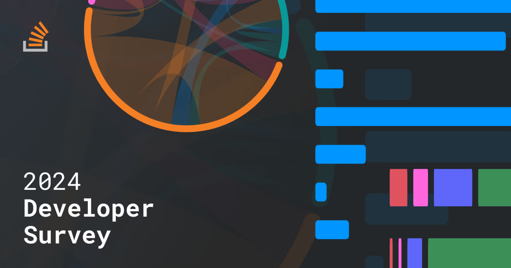
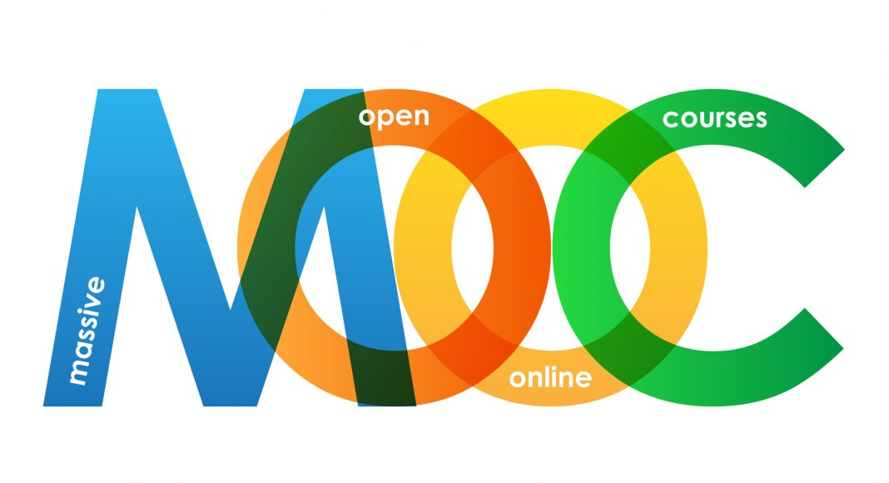

<div align="center">
  
  
  <h1>Online Learning: Do Massive Open Online Courses (MOOC) Meet Industry Demand</h1>
  <p>
    Milestone I MADS Project. Exploring the trends of skills offered by MOOC platforms with skills desired by software engineers and data scientists
  </p>

</div>

<br />

<!-- Badges -->

## Tools


---

<br />

<!-- Table of Contents -->

# :notebook_with_decorative_cover: Table of Contents

- [About the Project](#star2-about-the-project)
- [Setup](#wrench-setup)
- [Details on Data](#bookmark_tabs-details-on-data)
- [notebook](#orange_book-notebooks)
- [Contact](#handshake-contact)
- [Acknowledgements](#gem-acknowledgements)

<!-- About the Project -->

## :star2: About the Project

As the world becomes increasingly digital and online, we have seen a shift in the landscape of work and learning, with many employees and students moving to remote/ online platforms. As such, there is a distinct rise in the rise of Massive Online Open Course (MOOC) sites, as users turn to upskill themselves from the comfort of their own homes.

As MADS students who are both part of the online learning community and avid users of StackOverflow, we want to investigate the trends of the Software Development and Data Science industries by looking at trends within StackOverflow, and identify how online education has evolved over time.

## :wrench: Setup

_We recommend using a fresh virtual environment for this project_

1. Activate your virtual environment and install packags

```
pip install -r requirements.txt
```

2. Download data from links below and store them under `data/raw` under the main directory. Create another empty folder `data/clean` as well
3. Run the `data_preprocessing` notebook which will create 2 datasets under `data/clean`
4. Run the `so_mooc_analysis` notebook

## :bookmark_tabs: Details on Data

All data can be downloaded from the listed sources. A detailed description of the columns available after processing is in the `data_dictionary.xlsx` file.

Data should then be stored in the directory `/data/raw`. Output of the `data_processing` notebook will have cleaned datasets placed in `/data/clean`

- [Stack Overflow Developer Survey](https://survey.stackoverflow.co/) - A collection of historical survey results conducted by Stack Overflow to guage the trends of common skills and tools used by developers
- Various MOOC datasets - A collection of different course-related information from different MOOC platforms (e.g Coursera, EdX, Udemy). All data sourced from Kaggle
  - [EdX, Coursera, and Udemy Course Data](https://www.kaggle.com/datasets/kararhaitham/courses)
  - [15,000+ courses from 13 leading online providers](https://www.kaggle.com/datasets/aloktantrik/dataset-of-1200-coursera-courses)
  - [Coursera Dataset](https://www.kaggle.com/datasets/elvinrustam/coursera-dataset)
  - [Udacity Course Catalog](https://www.kaggle.com/datasets/patrickgendotti/udacity-course-catalog)
  - [Udemy Courses](https://www.kaggle.com/datasets/hossaingh/udemy-courses?select=Course_info.csv)

## :orange_book: Notebooks

There are 2 main notebooks that outline the project:

1. `data_processing.ipynb` - Data processing steps with justifications that transform raw data into clean data used in the analysis notebook. 2 files will be generated under the `data/clean` path, one for both the Stack Overflow dataset and MOOC datasets
2. `so_mooc_analysis.ipynb` - A walkthrough of the steps used to explore cleaned data, generate plots, derive insights from the data. This notebook is to be run after clean data has been generated.

A separate folder called "notebooks" that contains the individual notebooks that we both created to perform the analysis of our questions separately. Most relevant information can be found in the 2 combined notebooks. These notebooks serve as an appendix to our project

## :handshake: Contact

Authors: [Jonathan Hawley](https://github.com/jdhawley), [Martin Ho](https://github.com/minimartzz)

Project Link: [Github](https://github.com/minimartzz/online-learning-so-mooc)

<!-- Acknowledgments -->

## :gem: Acknowledgements

- [Stack Overflow Developer Survey Image](https://stackoverflow.blog/2024/05/20/the-good-the-bad-and-the-disruptive-let-us-know-where-you-stand-in-the-2024-annual-developer-survey/)
- [MOOC Image](https://educationaltechnology.net/massive-open-online-courses-moocs-definitions/)
